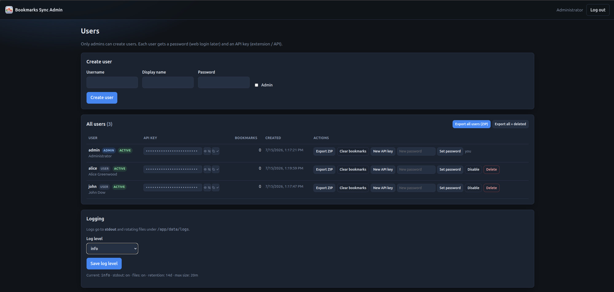
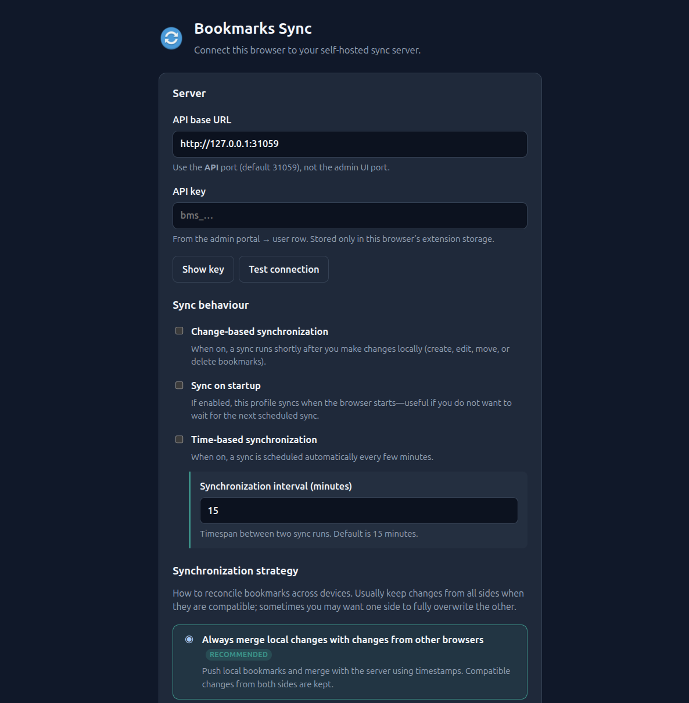
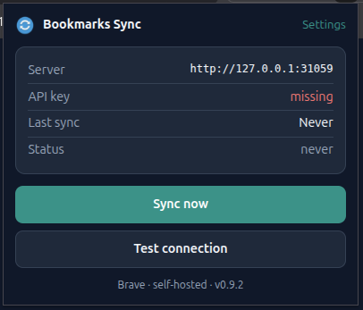

# Bookmarks Sync

**Version:** `1.2.1`

Self-hosted multi-user bookmark sync API for browsers and scripts, plus a companion **Manifest V3** extension for **Chrome**, **Brave**, and **Firefox**. Admins manage users in a web portal; each user gets an API key and isolated bookmarks in SQLite. Designed to sit behind Caddy (or similar) for HTTPS—not a full xBrowserSync clone (no mandatory E2E encryption).

**Stack:** Node.js + Express + SQLite · **Auth:** admin session (UI) + per-user API keys (REST / extension) · **Conflicts:** optimistic locking via `updatedAt` on writes; sync merges by newest timestamp.

**Multi-user model** (inspired by [Baikal](https://github.com/sabre-io/Baikal)-style admin accounts and [xBrowserSync](https://github.com/offsyanka99/xbrowsersync)-style sync):

| Who | How they authenticate | What they get |
|---|---|---|
| **Admin** | Username + password (web UI) | Create/manage users, view/copy API keys |
| **Users** | Per-user **API key** (REST API / browser extension) | Only their own bookmarks |

There is **no shared global API key**. Each user has a unique key; all bookmark operations are filtered by `user_id`.

## Screenshots

### Admin portal

User management, API keys, export, and logging:



### Browser extension

Options (server URL, API key, sync behaviour) and the toolbar popup:

| Options | Popup |
|---|---|
|  |  |

### What’s new in 1.2.1

- **Duplicate detection:** folder-scoped same-URL report (`GET /api/bookmarks/duplicates`) and optional soft-delete cleanup (`POST /api/bookmarks/dedupe`; admin **Dedupe** button)
- **Sync merge by folder+URL:** when a client pushes a new id for a URL that already exists in the same folder, the server updates the existing row instead of creating a twin (response includes `merges`)
- **Extension:** match local bookmarks by URL when applying server data (setting **Match local bookmarks by URL**, on by default); Test connection result shows **inline under the button**
- **Admin session timeout:** `SESSION_MAX_AGE_MINUTES` (default **15**), rolling cookie

### 1.2.0

- **Admin confirmation dialogs** for delete user, clear bookmarks, and regenerate API key
- **Reset to default** (danger zone): wipe all users, bookmarks, and the DB, log out, return to `/setup`

### 1.1.0

- **First-run setup:** no admin password in `.env` / YAML — open admin UI → `/setup` → set password for `admin` → API key generated → login
- **`SESSION_SECRET` auto-generated** into the data volume (`.session-secret`) when unset
- **TrueNAS / Docker:** deploy without embedding credentials

### 1.0.0 — first stable release

- **Server:** multi-user SQLite API + admin portal, Docker / TrueNAS SCALE deploy
- **Chrome extension:** live on the [Chrome Web Store](https://chromewebstore.google.com/detail/bookmarks-sync/ndiehbfpikbmhdgffcfohoeojlmfbpal)
- **Firefox extension:** Manifest V3 companion (signed XPI / temporary load for dev)
- **Sync:** merge / download / upload strategies, folders + order, failsafe for large deletes
- **Ops:** Winston logs (stdout for Dozzle), production secret checks, plain-HTTP LAN admin UI (TrueNAS-friendly CSP)

---

## Architecture

Two HTTP ports run from one process (`server.js`):

| Port | Env | Purpose |
|---|---|---|
| **API** | `SERVER_PORT` (default `31059`) | REST API for bookmark sync |
| **Admin** | `ADMIN_PORT` (default `31060`) | Admin web portal only |

```
┌──────────────────┐   ┌──────────────────┐   ┌──────────────────────────┐
│ Chrome / Brave   │   │ Firefox          │   │ Admin UI (ADMIN_PORT)    │
│ MV3 extension    │   │ MV3 extension    │   │ session · users · keys   │
└────────┬─────────┘   └────────┬─────────┘   └────────────┬─────────────┘
         │  Bearer API key      │                          │
         └──────────┬───────────┘                          │
                    ▼                                      │
         ┌──────────────────────────┐                      │
         │ Bookmark Sync API        │◄─────────────────────┘
         │ SERVER_PORT              │
         │ /health  /info           │
         │ /api/bookmarks/*         │
         └────────────┬─────────────┘
                      ▼
               SQLite (data/bookmarks.db)
               users + bookmarks (user_id)
```

Extension package: [`bookmarks-extension/`](./bookmarks-extension/) — see [Browser extension](#browser-extension-chrome--brave--firefox) below.

---

## Project structure

```
bookmarks-sync/
├── package.json
├── server.js                 # Starts API + admin servers
├── .env / .env.example
├── Dockerfile
├── docker-compose.yml
├── public/                   # Admin CSS, favicons, brand icons
├── assets/                   # Source brand / extension icon masters
├── data/
│   └── bookmarks.db          # Created on first start
├── src/
│   ├── routes/
│   ├── controllers/
│   ├── models/
│   ├── middleware/           # Session (admin) + API key (API)
│   ├── views/
│   └── utils/
├── bookmarks-extension/
│   ├── chrome/                    # Chrome source (store + load unpacked)
│   ├── firefox/                   # Firefox build (sync from chrome/)
│   ├── CHROME-STORE.md            # Store listing + publish notes
│   ├── FIREFOX-INSTALL.md         # Signed .xpi install
│   ├── shared/icons/              # Icon source of truth
│   ├── scripts/sync-firefox.mjs   # npm run ext:sync (chrome → firefox)
│   ├── scripts/check-extension-sync.mjs  # npm run ext:check
│   └── README.md
├── dist/
│   └── bookmarks-sync-firefox-*.xpi  # Firefox package (sign for release Firefox)
├── docs/
│   ├── PRIVACY.md / privacy.html     # Extension privacy policy
│   ├── screenshots/                  # README screenshots
│   └── truenas-scale.compose.yaml    # TrueNAS SCALE custom app example
└── README.md
```

---

## Features

- **Multi-user**: admin creates accounts; no public signup
- **Admin portal** on a **separate port** from the API
- **First-run setup** in the admin UI (default username `admin`); no password required in env/YAML
- **Username + password** for admin web login after setup
- **Per-user API keys** for `/api/bookmarks` (extension / scripts), with **copy** in the admin UI
- **Confirm dialogs** for destructive admin actions (delete user, clear bookmarks, new API key)
- **Factory reset** from the admin UI (danger zone → `/setup`)
- Bookmarks **scoped by user** (`user_id`)
- SQLite (WAL mode), soft deletes, import/export, full sync
- Optional env bootstrap / password reset via `ADMIN_PASSWORD` + `RESET_ADMIN_PASSWORD`
- **Production safeguards:** auto or explicit `SESSION_SECRET`; strong passwords on setup/bootstrap; login & API-key rate limits
- **Browser extension (Chrome / Brave / Firefox)** — see [`bookmarks-extension/`](./bookmarks-extension/)

**Not yet**

- End-user web UI for managing bookmarks in the browser
- Signed Firefox AMO release (temporary / self-install works today)
- CSRF tokens on admin forms / hashed API keys (planned hardening)

---

## Quick start (local)

```bash
cp .env.example .env
# No ADMIN_PASSWORD required — complete setup in the browser on first run

npm install
npm start
```

Then open:

| Service | URL (defaults) |
|---|---|
| Admin portal (first run → setup) | http://127.0.0.1:31060/ |
| API health | http://127.0.0.1:31059/health |

Dev mode (auto-restart on file changes, Node 20+):

```bash
npm run dev
```

### First-time admin (recommended)

1. Start the server with an empty database (no admin user yet).
2. Open the **admin UI** — you are redirected to **`/setup`**.
3. Set a password for the built-in username **`admin`** (min 8 characters; not a known default).
4. Copy the **API key** shown once on the success screen (also available later in the portal).
5. **Log in** at `/login` with `admin` + your password.

No admin password needs to live in `.env` or Docker/TrueNAS YAML.

**Optional headless bootstrap** (automation / CI): set `ADMIN_PASSWORD` (and optional `ADMIN_USERNAME`) before first start. The process creates the admin without the setup page. Weak passwords still fail closed in production.

> Changing `ADMIN_USERNAME` / `ADMIN_PASSWORD` in `.env` later does **not** update an existing admin. See [Reset admin password](#reset-admin-password).

### Create users

1. Log in to the admin portal (admin only in v1).
2. Create a user (username, password, optional display name) — or use the admin’s own API key for the extension.
3. **Copy** that user’s **API key** (copy icon next to the key).
4. Use the key with:
   - the **browser extension** (Options → API key), or  
   - any HTTP client against the **API port** (not the admin port).

See [Browser extension](#browser-extension-chrome--brave--firefox) for install steps.

---

## Environment variables

| Variable | Default | Description |
|---|---|---|
| `SERVER_PORT` | `31059` | Bookmark sync **API** port (inside process / container) |
| `ADMIN_PORT` | `31060` | **Admin UI** port (must differ from API) |
| `SERVER_HOST` | `0.0.0.0` | Bind address for both ports (keep `0.0.0.0` on Docker/TrueNAS) |
| `PUBLIC_HOST` | unset → `127.0.0.1` when bound to all interfaces | Optional LAN hostname/IP for **startup log URLs only** (e.g. `10.10.20.40`) |
| `PUBLIC_API_PORT` | same as `SERVER_PORT` | Optional host-mapped API port for log URLs (e.g. `31039`) |
| `PUBLIC_ADMIN_PORT` | same as `ADMIN_PORT` | Optional host-mapped admin port for log URLs (e.g. `31040`) |
| `ADMIN_USERNAME` | `admin` | Username for first-run setup / optional env bootstrap / reset |
| `ADMIN_PASSWORD` | unset | Optional. If set and no admin exists, create admin at startup (headless). Otherwise use UI `/setup` |
| `RESET_ADMIN_PASSWORD` | unset / `false` | Set to `true` once to re-apply admin login from env |
| `SESSION_SECRET` | auto file | Signs admin session cookies. Prefer env, else `data/.session-secret` (auto-created) |
| `SESSION_MAX_AGE_MINUTES` | `15` | Admin portal **idle** session lifetime (minutes). Cookie is **rolling** (refreshed while you use the UI). Set via env and restart — not a runtime UI toggle (ops best practice for self-hosted apps). |
| `COOKIE_SECURE` | `false` | Set `true` when admin UI is served over HTTPS. Also enables HSTS + CSP `upgrade-insecure-requests`. Leave **`false` on plain HTTP LAN** (e.g. TrueNAS) or CSS/icons will not load. |
| `CORS_ORIGINS` | empty | API CORS: empty = off; `*` = any origin; or comma-separated allowlist |
| `TRUST_PROXY` | `false` | Set when behind a reverse proxy so `req.ip` / rate limits are correct |
| `LOGIN_RATE_MAX` | `20` | Max admin login attempts per IP per window |
| `LOGIN_RATE_WINDOW_MS` | `900000` | Login rate-limit window (15 minutes) |
| `API_KEY_RATE_MAX` | `60` | Max **failed** API-key attempts per IP per window |
| `API_KEY_RATE_WINDOW_MS` | `900000` | API-key failure rate-limit window (15 minutes) |
| `DB_PATH` | `./data/bookmarks.db` | SQLite database path |
| `ALLOW_NEW_SYNCS` | `true` | Set `false` to reject sync pushes |
| `MAX_SYNC_SIZE_BYTES` | `1048576` | Max request body size (1 MiB) |
| `STATUS_MESSAGE` | — | Public message on `GET /info` |
| `LOG_LEVEL` | `info` | Initial log level (`error`…`silly`); overridable in Admin UI |
| `LOG_DIR` | `./data/logs` | Rotating log file directory |
| `LOG_TO_STDOUT` | `true` | Write logs to stdout (**required for Dozzle**) |
| `LOG_TO_FILE` | `true` | Write rotating files under `LOG_DIR` |
| `LOG_STDOUT_FORMAT` | see note | `json` (prod/Dozzle) or `pretty` (local) |
| `LOG_MAX_FILES` | `14d` | File retention (winston-daily-rotate-file) |
| `LOG_MAX_SIZE` | `20m` | Max size per log file before rotate |

`RESET_ADMIN_PASSWORD=false` (or omitted / commented out) is safe and does nothing. Only the value `true` triggers a reset.

### Production secrets

When `NODE_ENV=production` (Docker Compose sets this):

| Check | Behavior |
|---|---|
| `SESSION_SECRET` unset | **Auto-generated** into the data dir (`.session-secret`) |
| `SESSION_SECRET` set but insecure (short / placeholder) | **Process exits** |
| First-run `/setup` with weak password | Form error (admin not created) |
| Env bootstrap / `RESET_ADMIN_PASSWORD=true` with weak `ADMIN_PASSWORD` | **Process exits** |

Typical Docker / TrueNAS: **no secrets in compose** — open the admin UI and complete setup.

Optional headless:

```bash
export ADMIN_PASSWORD='your-strong-password'
export SESSION_SECRET="$(openssl rand -hex 32)"   # optional; else auto file
docker compose up -d --build
```

---

## Logging & Dozzle (TrueNAS)

Logs use **Winston** with:

| Destination | Purpose |
|---|---|
| **stdout** | Docker / TrueNAS container logs → **[Dozzle](https://dozzle.dev/)** |
| **Rotating files** | `data/logs/app-YYYY-MM-DD.log`, `error-*.log`, `exceptions-*.log`, `rejections-*.log` |

### Levels

`error` &lt; `warn` &lt; `info` &lt; `http` &lt; `verbose` &lt; `debug` &lt; `silly`

Change at runtime in the **Admin UI → Logging** section (persisted in the DB). Initial value comes from `LOG_LEVEL`.

### What is logged

- Server start / shutdown  
- Admin login success/failure, user create/delete, API key regenerate  
- HTTP access (Morgan → `http` level)  
- Bookmark sync/import summaries  
- API/admin errors, uncaught exceptions, unhandled rejections  

### Dozzle on TrueNAS Scale

Dozzle tails **container stdout/stderr**, not files inside the volume.

1. Keep **`LOG_TO_STDOUT=true`** (default).  
2. In production, logs are **JSON lines** on stdout (`LOG_STDOUT_FORMAT=json` or `NODE_ENV=production`).  
3. Deploy bookmarks-sync as a Docker/TrueNAS app so it appears in Dozzle’s container list.  
4. Open Dozzle and select the **bookmarks-sync** container — live logs appear there.  
5. Optional: keep `LOG_TO_FILE=true` for on-disk archives under the data volume (`/app/data/logs` in Docker).

Local dev uses prettier console lines unless you set `LOG_STDOUT_FORMAT=json`.

---

## Session secret (`SESSION_SECRET`) and timeout

This value is the **secret key used to sign the admin portal’s session cookie**.

When you log in to the admin UI, Express creates a **new** session id (`session.regenerate`) and stores a cookie in your browser (`bms.sid`). That cookie is **signed** with `SESSION_SECRET` so the server can tell:

1. The cookie was issued by **this** server  
2. It was not **tampered with**

If the secret is wrong or changed, existing sessions become invalid and you must log in again.

**Idle timeout:** `SESSION_MAX_AGE_MINUTES` (default **15**). Prefer an **environment variable** (restart to apply) rather than a runtime UI toggle — session lifetime is security/ops policy and matches Docker/TrueNAS config practice. Cookies are **rolling**: each authenticated request refreshes the expiry so active use does not log you out mid-task. Previously this was a hard-coded 7-day cookie.

### Resolution order

1. **`SESSION_SECRET` env** — if set to a strong value (≥16 chars, not a known placeholder)
2. **File next to the DB** — `data/.session-secret` (or alongside `DB_PATH`)
3. **Auto-generate** — write a new random secret to that file (mode `0600`) and use it

You do **not** need to put a secret in TrueNAS YAML for a normal deploy. Keep the data volume so the file survives restarts.

### Optional: set explicitly

```bash
openssl rand -hex 32
# or: node -e "console.log(require('crypto').randomBytes(32).toString('hex'))"
```

```env
SESSION_SECRET=paste-the-output-here
```

Keep secrets private. Do not commit `.env` or `.session-secret` (both are gitignored).

### Related credentials

| Credential | Used for |
|---|---|
| Admin password (from `/setup` or optional `ADMIN_PASSWORD`) | Admin web login |
| `SESSION_SECRET` (env or auto file) | Signing the cookie after login |
| User **API key** | Auth for the REST API / extension (not the admin web UI) |

---

## How to reset a forgotten admin password

`/setup` is **not** shown again after an admin already exists (unless you factory-reset).  
`RESET_ADMIN_PASSWORD=false` (or omitting the variable) does **nothing** — only `true` triggers a reset.

**Option A — Admin UI factory reset (1.2.0+):** open the portal → **Danger zone** → **Reset to default** → confirm with the checkbox. This deletes **all** users, bookmarks, and the database file, logs you out, and sends you to `/setup`. Export data first if you need a backup.

**Option B — env password reset** (keeps users/bookmarks; only changes admin login). In `.env` (or container env):

```env
ADMIN_USERNAME=admin
ADMIN_PASSWORD=your-new-strong-password
RESET_ADMIN_PASSWORD=true
```

1. Restart the server once (`npm start` / redeploy).
2. Confirm a log line like: `Reset admin login from env → username "admin"`.
3. Set `RESET_ADMIN_PASSWORD=false` (or remove the line) and restart again.
4. Log in with `admin` + the new password.

---

## Admin portal (v1)

Base URL: `http://127.0.0.1:<ADMIN_PORT>/`

| Path | Description |
|---|---|
| `GET /setup` | First-run: set password for `admin` (only if no admin exists) |
| `POST /setup` | Create admin + API key |
| `GET /login` | Login form (username + password) |
| `POST /login` | Authenticate (session cookie) |
| `POST /logout` | End session |
| `GET /` | User list + create form (admins only) |
| `POST /users` | Create user |
| `POST /users/:id/regenerate-key` | Issue a new API key |
| `POST /users/:id/password` | Set password |
| `POST /users/:id/enable` / `disable` | Activate / deactivate |
| `POST /users/:id/delete` | Delete user and their bookmarks |
| `POST /users/:id/clear-bookmarks` | Permanently delete all bookmarks for a user |
| `POST /settings/log-level` | Change log level |
| `POST /settings/reset` | Factory reset: wipe DB, log out, return to `/setup` |

Only users with the **admin** flag can use this UI. Non-admin accounts are for API access only (for now). Destructive actions use in-page confirmation dialogs; factory reset also requires an acknowledgment checkbox.

---

## API (multi-user)

Base URL: `http://127.0.0.1:<SERVER_PORT>/`

### Public (no auth)

| Method | Path | Description |
|---|---|---|
| `GET` | `/health` | Liveness probe |
| `GET` | `/info` | Minimal public status (`name`, `version`, `status`, `message`, `allowNewSyncs`, …) |
| `GET` | `/` | Short API landing page |

### Authenticated (per-user API key)

Send the key from the admin UI for that user:

```http
Authorization: Bearer bms_<key>
```

or:

```http
X-API-Key: bms_<key>
```

All routes below operate **only on that user’s bookmarks**.

| Method | Path | Description |
|---|---|---|
| `GET` | `/api/bookmarks` | List (`?folder=`, `?includeDeleted=true`) |
| `GET` | `/api/bookmarks/:id` | Get one |
| `POST` | `/api/bookmarks` | Create (`?merge=true` updates same folder+URL twin instead of `409`) |
| `PUT` | `/api/bookmarks/:id` | Update (optimistic lock; see below) |
| `DELETE` | `/api/bookmarks/:id` | Soft-delete (`?hard=true` permanent; optimistic lock) |
| `POST` | `/api/bookmarks/sync` | Merge push by `updatedAt` (see conflict handling) |
| `GET` | `/api/bookmarks/duplicates` | Report folder-scoped same-URL groups |
| `POST` | `/api/bookmarks/dedupe` | Soft-delete extras in each group (`{ "dryRun": true }` to preview) |
| `GET` | `/api/bookmarks/export` | JSON export |
| `POST` | `/api/bookmarks/import` | Same merge rules as sync |

Invalid or missing key → `401`. Data from other users is never returned.

### Conflict handling

Multi-device safety uses **`updatedAt`** (ISO-8601) as an optimistic version token. No E2E encryption is involved.

#### Single-item writes (`PUT` / `DELETE`)

1. Client `GET`s a bookmark and keeps `updatedAt`.
2. On `PUT`, send the **same** `updatedAt` in the body (plus changed fields).
3. Server applies the change only if it still matches; then sets a new `updatedAt`.
4. If the server row changed → **`409 Conflict`** with the current `server` object.

```bash
# Update (must include updatedAt from last GET)
curl -s -X PUT "$BASE/api/bookmarks/$ID" \
  -H "Authorization: Bearer $USER_API_KEY" \
  -H "Content-Type: application/json" \
  -d "{\"title\":\"New title\",\"updatedAt\":\"$UPDATED_AT\"}"
```

| Situation | HTTP | Notes |
|---|---|---|
| `updatedAt` matches | `200` | Write applied |
| `updatedAt` missing | `400` | `missing_updated_at` |
| `updatedAt` differs | `409` | `conflict` + `server` bookmark |
| Force overwrite | `200` | `?force=true` or `"force": true` skips the check |

Delete:

```bash
curl -s -X DELETE "$BASE/api/bookmarks/$ID?updatedAt=$UPDATED_AT" \
  -H "Authorization: Bearer $USER_API_KEY"

# Permanent
curl -s -X DELETE "$BASE/api/bookmarks/$ID?hard=true&updatedAt=$UPDATED_AT" \
  -H "Authorization: Bearer $USER_API_KEY"

# Force delete without version check
curl -s -X DELETE "$BASE/api/bookmarks/$ID?force=true" \
  -H "Authorization: Bearer $USER_API_KEY"
```

Create with a client-chosen `id` that already exists → **`409`**.  
Create with a **new** `id` but same **folder + URL** as an active row → **`409`** (`duplicate_url`) unless `merge=true` (then update the existing row).

#### Duplicates (folder + URL)

A **duplicate** is two or more **active URL bookmarks** with the same **folder** and the same **normalized URL** (via `URL().href` when parseable).  
Same URL in **different folders** is allowed (not a duplicate). Folder rows (`__dir__` / empty url) are ignored.

| Endpoint | Behaviour |
|---|---|
| `GET /api/bookmarks/duplicates` | Groups with `count ≥ 2`, `keepId` (newest), and member bookmarks |
| `POST /api/bookmarks/dedupe` | Soft-deletes extras; keeps newest `updatedAt` (then lowest position). Body `{ "dryRun": true }` previews |
| Admin UI **Dedupe** | Same cleanup for one user (confirm dialog) |

#### Sync / import (`POST /api/bookmarks/sync`)

Body:

```json
{
  "bookmarks": [ { "id": "...", "title": "...", "url": "...", "updatedAt": "..." } ],
  "replace": false,
  "lastSyncAt": "2026-07-13T12:00:00.000Z",
  "force": false,
  "mergeDuplicates": true
}
```

Per bookmark (same user):

| Case | Action |
|---|---|
| No server row | **Create** |
| No server row for client `id`, but same **folder+URL** exists | **Merge** into existing id (no second row); listed in `merges` |
| Client `updatedAt` **newer** than server | **Update** server |
| Client `updatedAt` **older** than server | **Skip**; listed in `conflicts` (`server_newer`) |
| Same `updatedAt`, fields unchanged | **Unchanged** |
| Same `updatedAt`, but title/url/folder/position/notes/tags/favicon differ | **Update** (reorder / content fix; server bumps `updatedAt`) |
| `force: true` | Always apply client values |
| `mergeDuplicates: false` | Disable folder+URL merge on create (legacy behaviour) |

`replace: true` soft-deletes server bookmarks **not** in the payload:

- With **`lastSyncAt`**: only deletes rows whose `updatedAt` is **≤** `lastSyncAt` (does not wipe newer server-only edits).
- Without `lastSyncAt`, or with **`force: true`**: aggressive replace (client membership wins).

Example response:

```json
{
  "created": 1,
  "updated": 2,
  "unchanged": 5,
  "skipped": 1,
  "deleted": 0,
  "merged": 1,
  "merges": [
    { "clientId": "...", "serverId": "...", "folder": "other:", "url": "https://example.com/" }
  ],
  "processed": 9,
  "conflicts": [
    {
      "id": "...",
      "reason": "server_newer",
      "server": { },
      "client": { }
    }
  ],
  "count": 8,
  "bookmarks": [ ],
  "lastSyncAt": "..."
}
```

Clients (e.g. a browser extension) should store `lastSyncAt`, send it on the next sync, apply `merges` to the local id map, and resolve `conflicts` locally when needed.

### Bookmark object

```json
{
  "id": "uuid",
  "userId": "uuid",
  "title": "Example",
  "url": "https://example.com",
  "folder": "Work/Tools",
  "tags": ["dev", "docs"],
  "notes": "",
  "favicon": null,
  "position": 0,
  "createdAt": "2026-07-13T12:00:00.000Z",
  "updatedAt": "2026-07-13T12:00:00.000Z",
  "deletedAt": null
}
```

### Example requests

```bash
# API port (not admin port)
export BASE=http://127.0.0.1:31059
# Copy from admin UI for this user
export USER_API_KEY='bms_...'

# List (only this user's bookmarks)
curl -s "$BASE/api/bookmarks" \
  -H "Authorization: Bearer $USER_API_KEY"

# Create
curl -s -X POST "$BASE/api/bookmarks" \
  -H "Authorization: Bearer $USER_API_KEY" \
  -H "Content-Type: application/json" \
  -d '{"title":"Example","url":"https://example.com","folder":"Work","tags":["demo"]}'

# Full sync (replace this user's set)
curl -s -X POST "$BASE/api/bookmarks/sync" \
  -H "Authorization: Bearer $USER_API_KEY" \
  -H "Content-Type: application/json" \
  -d '{"replace":true,"bookmarks":[{"title":"A","url":"https://a.example"}]}'

# Export
curl -s "$BASE/api/bookmarks/export" \
  -H "Authorization: Bearer $USER_API_KEY" \
  -o bookmarks-export.json
```

---

## Docker

`.dockerignore` excludes `.env`, `data/`, and `node_modules/` so secrets and the SQLite DB are never copied into image layers.

Expose **both** ports and pass **strong** secrets (production fails closed without them):

```bash
docker build -t bookmarks-sync:latest .

docker run -d \
  --name bookmarks-sync \
  -p 31059:31059 \
  -p 31060:31060 \
  -e SERVER_PORT=31059 \
  -e ADMIN_PORT=31060 \
  -e DB_PATH=/app/data/bookmarks.db \
  -e NODE_ENV=production \
  -v bookmarks-sync-data:/app/data \
  bookmarks-sync:latest
```

Then open the admin UI and complete **first-run setup** (set password for `admin`).  
Optional: pass `-e ADMIN_PASSWORD=...` and/or `-e SESSION_SECRET=...` for headless bootstrap.

### docker-compose

```bash
docker compose up -d --build
```

No required secrets. Database + auto session secret: `/app/data` volume.  
Optional env: `ADMIN_PASSWORD`, `SESSION_SECRET`, `SESSION_MAX_AGE_MINUTES` (see `.env.example`).

### TrueNAS SCALE (custom app YAML)

Ready-to-paste Compose example (ports, dataset volume, 1 CPU / 512 MB limits — **no passwords in YAML**):

**[`docs/truenas-scale.compose.yaml`](./docs/truenas-scale.compose.yaml)**

1. Create a dataset (e.g. `tank/apps/bookmarks-sync`).
2. **Permissions (important):** on TrueNAS SCALE Apps the process should run as the **`apps` user (uid/gid 568)**. On TrueNAS Shell:
   ```bash
   mkdir -p /mnt/tank/apps/bookmarks-sync
   chown -R 568:568 /mnt/tank/apps/bookmarks-sync
   id apps   # confirm uid=568 gid=568
   ```
   The example YAML sets `user: "568:568"`. Without matching ownership you get `EACCES: permission denied, mkdir '/app/data/logs'` and the container restarts.
   (Plain Docker outside TrueNAS still uses image default uid **1001** — see `Dockerfile`.)
3. Copy the example YAML into **Apps → Custom App / Install via YAML** (set host path under `volumes:`).
4. Keep `SERVER_HOST=0.0.0.0` (listen address inside the container — not your NAS LAN IP).
5. After deploy:
   - **Admin UI**: `http://NAS-IP:31040` → complete **`/setup`** (password for `admin`)
   - **API** (extension): `http://NAS-IP:31039`
6. Optional recovery only: `ADMIN_PASSWORD` + `RESET_ADMIN_PASSWORD: "true"` once, then remove.

Suggested resources: **1 CPU**, **512 MiB** RAM (raise to 1 GB only for very large libraries).

---

## Browser extension (Chrome / Brave / Firefox)

Companion **Manifest V3** extension: [`bookmarks-extension/`](./bookmarks-extension/).  
Full reference (options, strategies, troubleshooting): **[bookmarks-extension/README.md](./bookmarks-extension/README.md)**.

### Overview

| | |
|---|---|
| **Browsers** | Chrome 116+, Brave, Firefox 128+ |
| **Auth** | Per-user API key (`Authorization: Bearer bms_…`) |
| **Talks to** | API port (`SERVER_PORT`), **not** the admin UI port |
| **Chrome install** | [Chrome Web Store](https://chromewebstore.google.com/detail/bookmarks-sync/ndiehbfpikbmhdgffcfohoeojlmfbpal) (recommended) |
| **Brave / dev** | Load **unpacked** → `bookmarks-extension/chrome/` |
| **Firefox install** | Signed XPI → `dist/bookmarks-sync-firefox-*.xpi` (or temporary add-on for dev) |

The extension does **not** use the admin password. Create a normal user (or use an admin’s API key) in the admin portal, copy the key, and paste it into extension Options.

### Server checklist before installing the extension

1. Server is running (`npm start` or Docker).
2. Admin portal is reachable; you have created a **user** (or use admin).
3. Copy that user’s **API key** (copy button in the users table).
4. Note the **API** base URL only, for example:

   | Setup | Example API base URL |
   |---|---|
   | Local default ports | `http://127.0.0.1:31059` |
   | Custom `.env` `SERVER_PORT` | `http://127.0.0.1:31039` |
   | Behind reverse proxy | `https://bookmarks.example.com` |

   Do **not** use `ADMIN_PORT` (e.g. 31060) in the extension.

5. Optional: if a web page will call the API cross-origin, set `CORS_ORIGINS` (extension `fetch` from a background script usually does **not** need CORS).

### Install — Chrome / Brave

**Chrome Web Store (recommended):**

[**Bookmarks Sync on the Chrome Web Store**](https://chromewebstore.google.com/detail/bookmarks-sync/ndiehbfpikbmhdgffcfohoeojlmfbpal)

1. Install from the store listing.
2. Open the extension **Options** (or toolbar popup → **Settings**).
3. Set **API base URL** and **API key** → **Save** (allow host access when the browser prompts).
4. **Test connection**, then **Sync now** from the popup.

Works in Chrome and other Chromium browsers that support the Chrome Web Store (including Brave via store install or “Allow extensions from other stores”).

**Developer (unpacked):**

1. Open `chrome://extensions` or `brave://extensions`.
2. Enable **Developer mode**.
3. **Load unpacked** → select:

   ```text
   bookmarks-sync/bookmarks-extension/chrome
   ```

4. Configure Options as above.

**Publishing updates** (maintainers): pack ZIP and dashboard steps —  
[bookmarks-extension/CHROME-STORE.md](./bookmarks-extension/CHROME-STORE.md)

### Install — Firefox

**Permanent (recommended — works on release Firefox when signed):**

```text
dist/bookmarks-sync-firefox-1.1.0.xpi
```

1. `about:addons` → gear → **Install Add-on From File…**
2. Choose that `.xpi` → confirm → **Options** → API URL + key → **Save**.

Release Firefox requires a **Mozilla-signed** XPI (repo rebuilds may be unsigned until re-signed).  
Full steps, updates, and self-sign workflow:  
[bookmarks-extension/FIREFOX-INSTALL.md](./bookmarks-extension/FIREFOX-INSTALL.md)

**Temporary (dev only — removed when Firefox quits):**

1. `npm run ext:sync`
2. `about:debugging` → Load Temporary Add-on → `bookmarks-extension/firefox/manifest.json`

Do **not** load `bookmarks-extension/chrome/` into Firefox.

### What the extension can do

| Feature | Description |
|---|---|
| **Sync now** | Manual full sync from the toolbar popup |
| **Test connection** | Hits `/health`, `/info`, and authenticated list |
| **Change-based sync** | Debounced sync after local bookmark create/edit/move/delete |
| **Sync on startup** | Sync a few seconds after the browser profile starts |
| **Time-based sync** | Periodic alarm (default interval **15** minutes) |
| **Merge** (default) | Keep compatible changes from this browser and the server |
| **Download** | Server wins — overwrite this browser from the server |
| **Upload** | This browser wins — force local tree onto the server |

### Extension settings (Options page)

**Server**

- API base URL  
- API key  

**Sync behaviour**

- Change-based synchronization (on/off)  
- Sync on startup (on/off)  
- Time-based synchronization (on/off) + interval in minutes  

**Synchronization strategy** (one of)

- Always merge local changes with changes from other browsers *(recommended)*  
- Always undo local changes and download from other browsers  
- Always upload local changes and undo changes from other browsers  

**Advanced**

- Where *new* server bookmarks are created (Other Bookmarks / Bookmarks Bar)  
- Remove local bookmarks deleted on the server  

### API endpoints the extension uses

| Method | Path | When |
|---|---|---|
| `GET` | `/health` | Connection test |
| `GET` | `/info` | Connection test |
| `GET` | `/api/bookmarks` | Auth test; **download** strategy |
| `POST` | `/api/bookmarks/sync` | **merge** and **upload** strategies |

Auth header:

```http
Authorization: Bearer bms_<your-user-api-key>
```

### Troubleshooting (extension)

| Symptom | What to check |
|---|---|
| Network / host permission error | Re-save Options and **Allow** access to the API origin |
| `401 Unauthorized` | Wrong/expired API key; regenerate in admin UI and paste again |
| Sync hits wrong service | URL must be **API** port, not admin port |
| `service_worker is currently disabled` | Load `bookmarks-extension/firefox/`, not `chrome/` |
| Firefox missing latest UI/code | Run `npm run ext:sync`, then reload the temporary add-on |
| Firefox extension gone after close | Temporary add-on only lasts one session — install the signed `dist/bookmarks-sync-firefox-*.xpi` ([FIREFOX-INSTALL.md](./bookmarks-extension/FIREFOX-INSTALL.md)) |
| Changes not pushing | Strategy set to **Download**? Switch to **Merge** or **Upload** |
| Server rejects large payload | Raise `MAX_SYNC_SIZE_BYTES` or split/clean bookmarks |

More detail: [bookmarks-extension/README.md](./bookmarks-extension/README.md).

---

## License

MIT
